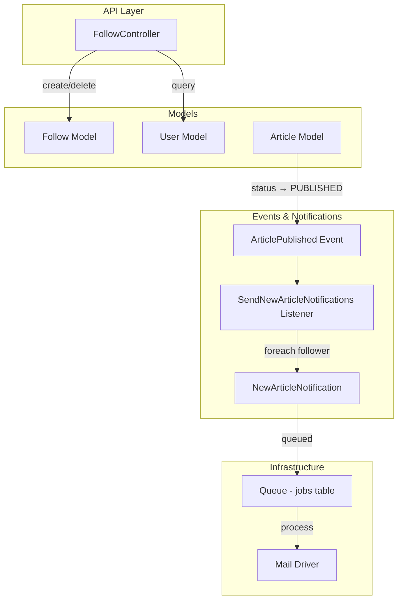
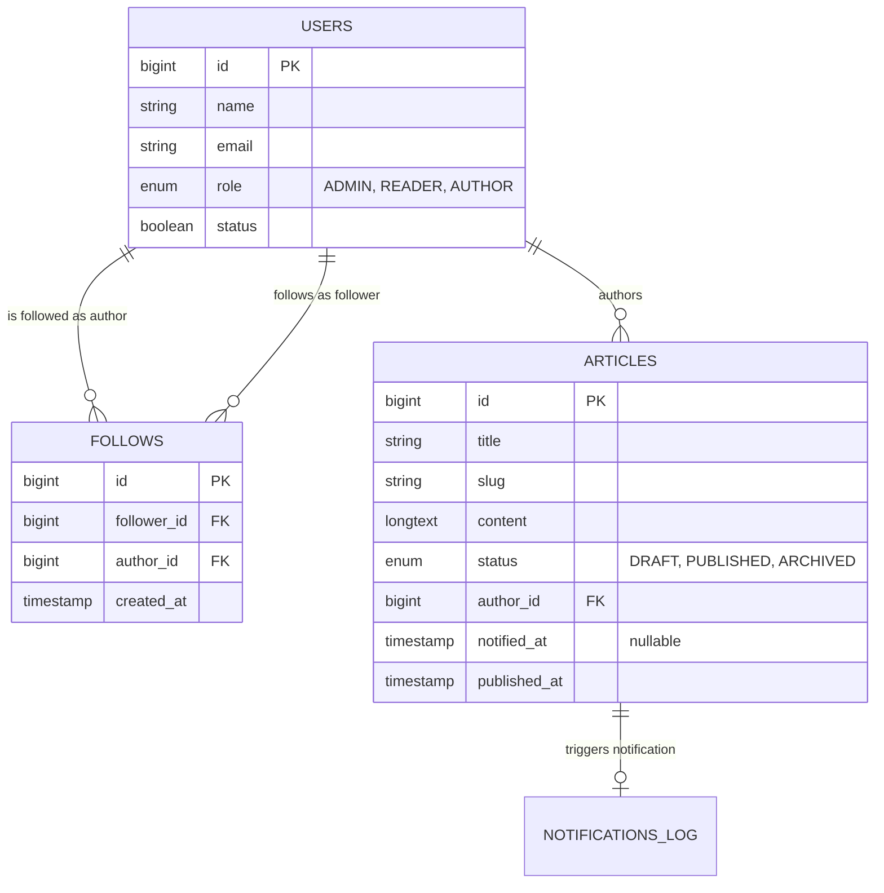

# Design Document: Author Follow Notifications

## Overview

This feature introduces an author-follow system where authenticated users can follow authors and receive email notifications when followed authors publish new articles. The design leverages Laravel's existing notification system, queue infrastructure, and event-driven architecture already present in the codebase (e.g., `ArticleEngaged` event with broadcasting).

The system consists of three main parts:
1. **Follow relationship management** — CRUD-like API for follow/unfollow with validation
2. **Notification dispatch** — Event-driven email notifications queued on article publication
3. **Follower count exposure** — Augmenting existing author profile/article responses with follower counts

## Architecture



### Design Decisions

1. **Pivot table (`follows`) over polymorphic relationship**: The follow relationship is strictly user-to-user. A simple pivot table with a unique constraint is the most performant and straightforward approach, consistent with how `likes` and `bookmarks` are implemented in this project.

2. **Laravel Notification system over raw Mail**: Using `Notification` gives us built-in queue support, retry logic, and the ability to add more channels (database, broadcast) later without changing the dispatch logic.

3. **Event + Listener pattern for publication notifications**: Decouples the article status change from notification logic. The `ArticlePublished` event fires only on first publication (tracked via a `notified_at` column on articles), and a queued listener handles fan-out to followers.

4. **Follower count via `withCount` rather than a cached counter**: For the current scale, `withCount('followers')` on the User model is sufficient. A denormalized counter column can be added later if query performance becomes an issue.

## Components and Interfaces

### Controllers

#### `FollowController`

| Method | Route | Description |
|--------|-------|-------------|
| `follow(Request, int $authorId)` | `POST /api/authors/{author}/follow` | Create follow relationship |
| `unfollow(Request, int $authorId)` | `DELETE /api/authors/{author}/follow` | Remove follow relationship |
| `following(Request)` | `GET /api/me/following` | List authors the current user follows |
| `followers(Request)` | `GET /api/me/followers` | List followers of the current author |
| `checkStatus(Request, int $authorId)` | `GET /api/authors/{author}/follow-status` | Check if current user follows author |

### Events

#### `ArticlePublished`

Dispatched when an article transitions to `PUBLISHED` status for the first time. Carries the `Article` model instance (with author relationship loaded).

### Listeners

#### `SendNewArticleNotifications`

Queued listener that:
1. Loads all followers of the article's author
2. Sends `NewArticleNotification` to each follower via the queue
3. Chunks followers in batches of 100 to avoid memory issues

### Notifications

#### `NewArticleNotification`

A `Mailable` notification implementing `ShouldQueue` with:
- 3 retry attempts (`$tries = 3`)
- Sends via the `mail` channel
- Contains: article title, 150-char excerpt, author name, article link

### Models

#### `Follow`

Eloquent model for the `follows` pivot table with relationships to both the follower (User) and the author (User).

## Data Models

### Database Tables

#### `follows` table

| Column | Type | Constraints | Description |
|--------|------|-------------|-------------|
| `id` | `bigint unsigned` | PRIMARY KEY, AUTO_INCREMENT | Row identifier |
| `follower_id` | `bigint unsigned` | FOREIGN KEY → users(id) ON DELETE CASCADE, NOT NULL | The user who follows |
| `author_id` | `bigint unsigned` | FOREIGN KEY → users(id) ON DELETE CASCADE, NOT NULL | The author being followed |
| `created_at` | `timestamp` | NOT NULL, DEFAULT CURRENT_TIMESTAMP | When the follow occurred (UTC) |

**Indexes:**
- `UNIQUE(follower_id, author_id)` — prevents duplicate follows
- `INDEX(author_id)` — fast lookup of an author's followers
- `INDEX(follower_id)` — fast lookup of a user's followed authors

#### `articles` table modification

| Column | Type | Constraints | Description |
|--------|------|-------------|-------------|
| `notified_at` | `timestamp` | NULLABLE | Timestamp when followers were notified of publication; prevents duplicate notifications |

### Entity Relationship Diagram



### Model Relationships

**User model additions:**

```php
// Users this user follows (as a follower)
public function following()
{
    return $this->belongsToMany(User::class, 'follows', 'follower_id', 'author_id')
                ->withPivot('created_at');
}

// Users who follow this user (as an author)
public function followers()
{
    return $this->belongsToMany(User::class, 'follows', 'author_id', 'follower_id')
                ->withPivot('created_at');
}
```

**Follow model:**

```php
class Follow extends Model
{
    protected $fillable = ['follower_id', 'author_id'];
    
    public $timestamps = false; // Only created_at, managed manually
    
    protected $casts = [
        'created_at' => 'datetime',
    ];

    public function follower()
    {
        return $this->belongsTo(User::class, 'follower_id');
    }

    public function author()
    {
        return $this->belongsTo(User::class, 'author_id');
    }
}
```


## Correctness Properties

*A property is a characteristic or behavior that should hold true across all valid executions of a system—essentially, a formal statement about what the system should do. Properties serve as the bridge between human-readable specifications and machine-verifiable correctness guarantees.*

### Property 1: Follow creates a valid relationship

*For any* authenticated user and any valid author (user with AUTHOR or ADMIN role, not the same user), calling the follow endpoint SHALL create exactly one Follow record linking the follower to the author, and the response SHALL contain the author's id, name, and a non-null UTC timestamp.

**Validates: Requirements 1.1, 1.5**

### Property 2: Follow is idempotent

*For any* authenticated user and any author they already follow, calling the follow endpoint again SHALL result in exactly one Follow record in the database (no duplicate), and SHALL return a successful response identical in structure to the first follow.

**Validates: Requirements 1.2**

### Property 3: Follow rejects non-author targets

*For any* authenticated user and any target user whose role is READER (not AUTHOR or ADMIN), calling the follow endpoint SHALL return a 422 error and SHALL NOT create any Follow record.

**Validates: Requirements 1.3**

### Property 4: Follow-then-unfollow round trip

*For any* authenticated user and any valid author, following and then unfollowing SHALL result in zero Follow records between that user and author, restoring the original state.

**Validates: Requirements 2.1**

### Property 5: Unfollow is idempotent

*For any* authenticated user and any author they do NOT follow, calling the unfollow endpoint SHALL return a successful response and SHALL NOT modify any data in the follows table.

**Validates: Requirements 2.2**

### Property 6: Following list correctness

*For any* authenticated user who follows N authors, requesting the following list SHALL return results paginated with at most 10 per page, sorted by follow timestamp descending, where each item contains the author's id, name, email, and the follow timestamp.

**Validates: Requirements 3.1, 3.2, 3.3**

### Property 7: Followers list correctness

*For any* author with N followers, requesting the followers list SHALL return results paginated with at most 15 per page, sorted by follow timestamp descending, where each item contains the follower's id, name, and the follow timestamp.

**Validates: Requirements 4.1, 4.2, 4.3**

### Property 8: Follow status reflects actual state

*For any* authenticated user and any valid author, the follow-status endpoint SHALL return `true` with a non-null timestamp if a Follow record exists, or `false` with a null timestamp if no Follow record exists.

**Validates: Requirements 5.1, 5.2**

### Property 9: Publication notifies exactly each follower once

*For any* author with N followers (N ≥ 0), when an article is published for the first time, exactly N email notifications SHALL be dispatched — one per follower, with no duplicates and no omissions.

**Validates: Requirements 6.1, 6.6**

### Property 10: Notification content completeness

*For any* published article, the notification sent to each follower SHALL contain the article title, a plain-text excerpt of at most 150 characters, the author's name, and a URL constructed from the article's slug.

**Validates: Requirements 6.2, 6.3**

### Property 11: Re-publication does not re-notify

*For any* article that has already triggered notifications (notified_at is non-null), transitioning the article from PUBLISHED → DRAFT → PUBLISHED SHALL NOT dispatch any additional notifications.

**Validates: Requirements 6.7**

### Property 12: Unfollow stops future notifications

*For any* user who unfollows an author, subsequent article publications by that author SHALL NOT result in notifications being sent to the unfollowed user.

**Validates: Requirements 2.3**

### Property 13: Follower count equals active relationship count

*For any* author, the follower count returned in profile or article responses SHALL equal the number of Follow records where that author is the `author_id` — always a non-negative integer, and 0 when no relationships exist.

**Validates: Requirements 7.1, 7.2, 7.3**

## Error Handling

| Scenario | HTTP Status | Response Body | Notes |
|----------|-------------|---------------|-------|
| Follow non-existent user | 404 | `{"message": "User not found"}` | Route model binding or manual check |
| Follow non-author user | 422 | `{"message": "Target user is not an author"}` | Role validation |
| Follow self | 422 | `{"message": "You cannot follow yourself"}` | Self-follow guard |
| Unfollow non-existent user | 404 | `{"message": "User not found"}` | Consistent with follow |
| Check status for non-existent/non-author | 404 | `{"message": "Author not found"}` | Combined check |
| Unauthenticated access | 401 | `{"message": "Unauthenticated."}` | Handled by `auth:sanctum` middleware |
| Non-author accessing followers list | 403 | `{"message": "Unauthorized"}` | Role middleware |
| Notification email delivery failure | — | Retry up to 3 times | Laravel queue retry; failed jobs logged to `failed_jobs` table |
| Database constraint violation (race condition on follow) | 409 or silent | Return existing follow | `firstOrCreate` handles gracefully |

### Error Handling Strategy

- **Validation errors** (422): Use Laravel Form Request or inline validation with descriptive messages
- **Not found errors** (404): Use `findOrFail` or manual checks with explicit error messages
- **Authorization errors** (403): Use role middleware for endpoint-level protection
- **Queue failures**: Laravel's built-in retry mechanism with `$tries = 3` on the notification class; failed notifications are logged to `failed_jobs` table without affecting other followers

## Testing Strategy

### Unit Tests (Pest)

Focus on specific examples and edge cases:
- Self-follow attempt returns 422
- Follow non-existent user returns 404
- Follow a READER returns 422
- Unfollow non-existent user returns 404
- Empty following/followers list returns correct empty paginated structure
- Unauthenticated access returns 401
- Non-author accessing followers list returns 403
- Notification content truncation at exactly 150 characters
- Article with `notified_at` set does not trigger notifications on re-publish

### Property-Based Tests (Pest with custom generators)

**Library**: Pest PHP with custom data providers generating randomized inputs (using Faker).

Each property test runs a minimum of **100 iterations** with randomized data.

**Tag format**: `Feature: author-follow-notifications, Property {number}: {property_text}`

Properties to implement as PBT:
- Property 1: Follow creates valid relationship (random user/author pairs)
- Property 2: Follow idempotence (random double-follow scenarios)
- Property 3: Follow rejects non-authors (random READER targets)
- Property 4: Follow/unfollow round trip (random pairs)
- Property 5: Unfollow idempotence (random unfollow-without-follow)
- Property 6: Following list correctness (random follow sets, verify pagination/sort)
- Property 7: Followers list correctness (random follower sets, verify pagination/sort)
- Property 8: Follow status accuracy (random pairs with/without follows)
- Property 9: Publication notification fan-out (random follower counts)
- Property 10: Notification content completeness (random article content)
- Property 11: Re-publication guard (random publish/unpublish/republish cycles)
- Property 12: Unfollow stops notifications (random follow/unfollow/publish sequences)
- Property 13: Follower count accuracy (random follow/unfollow operations)

### Integration Tests

- End-to-end follow → publish → verify email sent (using `Mail::fake()`)
- Queue job dispatch verification (using `Queue::fake()`)
- Database transaction integrity under concurrent follow/unfollow

### Test Infrastructure

- Use `RefreshDatabase` trait for test isolation
- Use `Mail::fake()` and `Notification::fake()` for notification assertions
- Use Laravel's `UserFactory` extended with role generation
- Create `ArticleFactory` for generating test articles with various statuses
